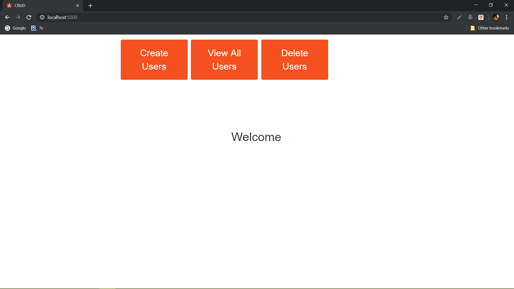
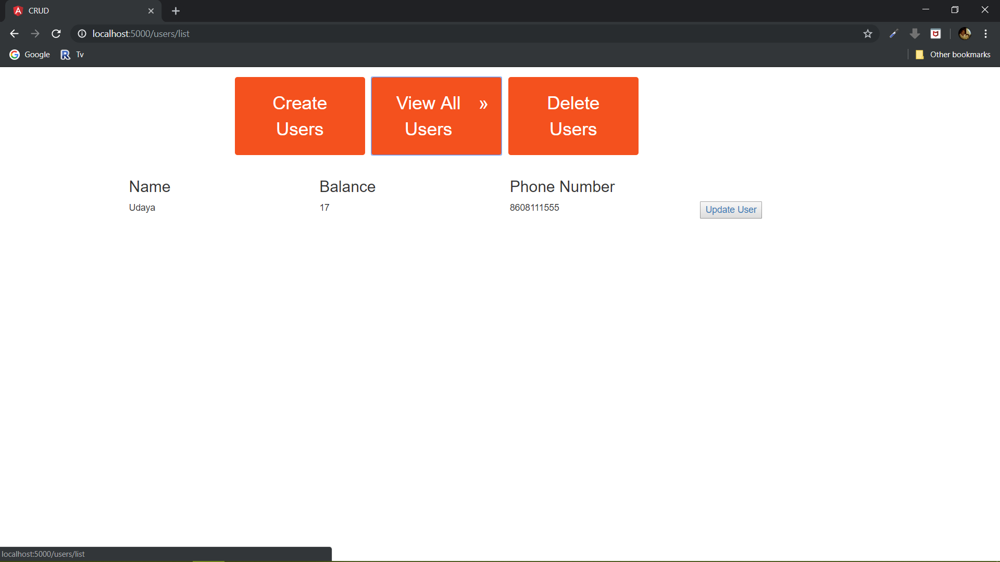
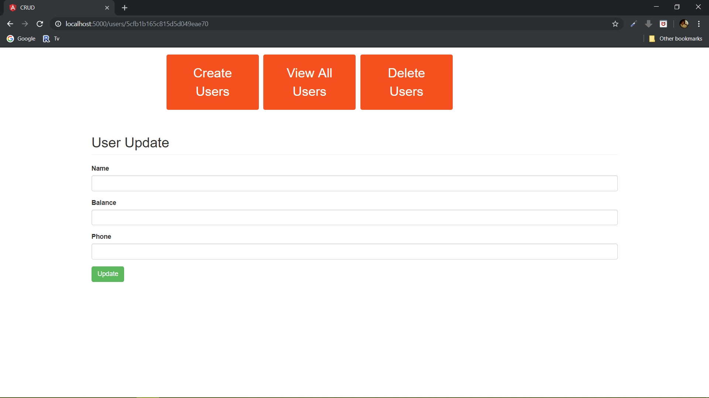
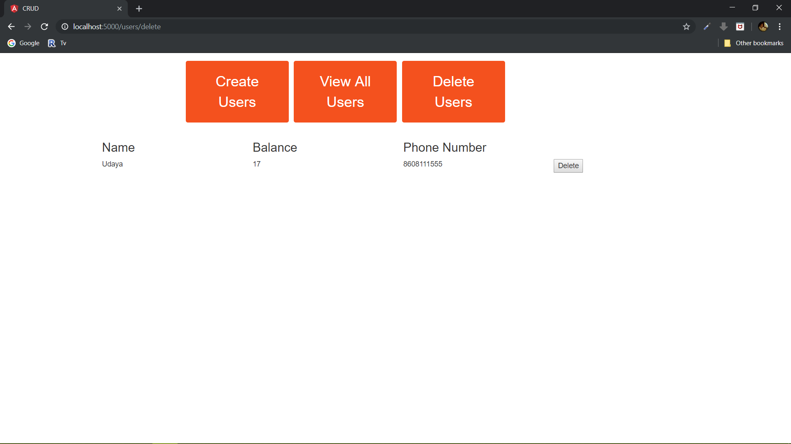

CRUD operations 
&nbsp;&nbsp;&nbsp;This is a MEAN Stack Development Project developed for internning under TSF. 
&nbsp;&nbsp;&nbsp;Its done for the phase 2 of TSF intern program. 

To run the server use nodemon(if not installed use 'node server.js') 

Screenshots and and demo video has been included in the DEMO folder.
***screenshot::***&nbsp;

  
  
  
  
  

